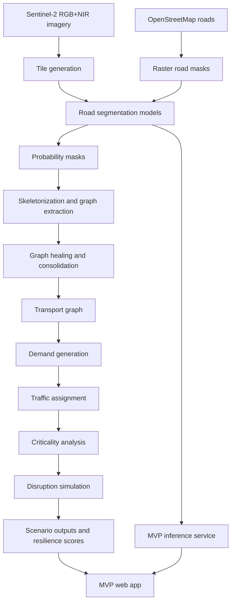

# Route Resilience: Occlusion-Robust Road Extraction and Graph-Theoretic Criticality Analysis

## 1. Executive Summary

This project builds an end-to-end urban mobility resilience system from satellite imagery. The system starts with multispectral road extraction, converts the predicted road mask into a routable graph, estimates critical intersections and corridors, simulates disruptions, and exposes the results through an offline desktop web MVP.

The original hackathon problem was divided into four technical parts:

1. Occlusion-robust road extraction from satellite imagery.
2. Road graph construction and graph healing.
3. Graph-theoretic and flow-aware criticality analysis.
4. Disruption simulation and resilience assessment.

The final demonstration system connects these parts into one workflow:

```text
Inspect satellite tile
-> run road-segmentation inference
-> explore road graph and criticality
-> select a disruption
-> preview impact
-> run exact rerouting
-> compare baseline and disrupted resilience
```

The project is designed as a research-to-demo pipeline. The heavy training, graph generation, and scenario stress tests are computed offline and cached. The MVP runs locally using FastAPI, Leaflet, and a static HTML/CSS/JavaScript interface. It can run without internet access during demonstration.

## 2. Problem Statement

Urban road networks are vulnerable to disruptions such as floods, construction closures, accidents, damaged bridges, blocked intersections, and sector-level disasters. A satellite-based planning system should help answer:

> If this junction or corridor fails, how badly does the city suffer?

The project solves this by extracting roads from satellite imagery, representing them as a graph, ranking critical infrastructure, and stress-testing the graph under simulated failures.

The expected planning value is:

- Identify road links and intersections that act as gatekeepers.
- Estimate which areas lose access under disruption.
- Measure rerouting burden and path degradation.
- Compare targeted disruptions against random failures.
- Provide explainable resilience indicators for city planners.

## 3. High-Level Architecture

The system has five major layers:

1. **Data layer**: Sentinel-2 RGB+NIR imagery, OpenStreetMap road labels, AOI manifests, generated image/mask tiles.
2. **Segmentation layer**: PyTorch road extraction models, synthetic occlusion augmentation, final SegFormer-based inference service.
3. **Graph layer**: skeletonization, node/edge extraction, graph healing, transport graph preparation.
4. **Mobility-analysis layer**: demand generation, traffic assignment, criticality ranking, disruption simulation.
5. **MVP layer**: FastAPI backend, cached geospatial layers, Leaflet frontend, live tile inference, scenario engine.



## 4. Repository Structure

```text
configs/                 YAML configs for experiments, MVP, Part 3 and Phase 4 scenarios
mobility/                Transport graph, demand, assignment, stress and simulation code
mvp/                     FastAPI backend and offline web interface
roadgraph/               Road skeletonization, graph extraction and healing logic
roadseg/                 PyTorch road-segmentation data, models, losses, metrics and scoring
scripts/                 Dataset preparation, reports, visualization and orchestration scripts
tests/                   Unit, integration and API tests
reports/                 Lightweight report summaries and score tables
data/metadata/           Small AOI metadata and download manifests
```

Large generated artifacts are intentionally excluded from GitHub:

- Raw satellite scenes.
- Processed training tiles.
- Model checkpoints.
- Runtime outputs under `runs/`.
- Generated `.docx`, `.pptx`, PDFs and heavy visual examples.

Those files are reproducible from the scripts and documented commands.

## 5. Dataset Sources

### 5.1 Sentinel-2 Level-2A

Primary training and testing imagery comes from Sentinel-2 Level-2A. We used 10 m bands:

- B02 Blue.
- B03 Green.
- B04 Red.
- B08 Near Infrared.

Links:

- Microsoft Planetary Computer Sentinel-2 L2A: https://planetarycomputer.microsoft.com/dataset/sentinel-2-l2a
- Microsoft Planetary Computer STAC documentation: https://planetarycomputer.microsoft.com/docs
- Copernicus Data Space Ecosystem: https://dataspace.copernicus.eu/
- Copernicus Sentinel data access description: https://sentinels.copernicus.eu/sentinel-data-access-description

The Planetary Computer Sentinel-2 L2A catalog provides STAC items and cloud-optimized GeoTIFF assets. The project stores local STAC metadata files such as:

```text
data/raw/sentinel2/bengaluru_core/stac_search_response.json
data/raw/sentinel2/bengaluru_edge/stac_search_response.json
data/raw/sentinel2/hyderabad_mixed/stac_search_response.json
```

### 5.2 Resourcesat LISS-IV

Resourcesat LISS-IV was part of the planned cross-sensor extension. The implementation does not block on Resourcesat because the final training and scoring used Sentinel-2. The code and report treat Resourcesat as a future adapter path.

Relevant links:

- ISRO Resourcesat-2 mission page: https://www.isro.gov.in/RESOURCESAT_2.html
- NRSC Bhoonidhi portal: https://bhoonidhi.nrsc.gov.in/bhoonidhi/home.html
- Bhoonidhi API specification: https://bhoonidhi.nrsc.gov.in/bhoonidhi-api/
- Bhoonidhi registration and data access page: https://bhoonidhi.nrsc.gov.in/bhoonidhi/registration.html

Bhoonidhi exposes Resourcesat collections such as:

```text
ResourceSat-2_LISS4-MX70_L2
ResourceSat-2A_LISS4-MX70_L2
```

The cross-sensor plan is:

```text
Sentinel-2 -> Sentinel-2
Resourcesat -> Resourcesat
Sentinel-2 -> Resourcesat
Resourcesat -> Sentinel-2
Mixed -> both
```

### 5.3 OpenStreetMap Roads

OpenStreetMap road geometries are used as weak labels for training and as controlled validation data for graph healing. Roads are downloaded per AOI and rasterized into binary masks.

Links:

- OpenStreetMap: https://www.openstreetmap.org/
- Overpass API manual: https://dev.overpass-api.de/overpass-doc/en/

Local examples:

```text
data/raw/osm/bengaluru_core/bengaluru_core-roads.osm
data/raw/osm/bengaluru_edge/bengaluru_edge-roads.osm
data/raw/osm/hyderabad_mixed/hyderabad_mixed-roads.osm
```

## 6. Dataset Used in the Final Experiments

The final expanded Sentinel-2 dataset contains:

```text
AOIs: 18
Tiles: 2,568
Tile size: 256 x 256
Stride: 128
Spatial resolution: 10 m
Input bands: RGBN
Labels: rasterized OpenStreetMap roads
```

Split summary:

| Split | Tiles | AOIs |
|---|---:|---|
| Train | 1,804 | bengaluru_core, pune, chennai, ahmedabad, jaipur, lucknow, bhopal, surat, nagpur, kochi, bhubaneswar, coimbatore, visakhapatnam |
| Validation | 460 | hyderabad_mixed, chandigarh, indore, mysuru |
| Test | 304 | bengaluru_edge |

The geographic split is intentional. It prevents tile leakage and tests whether the model generalizes to a held-out urban region.

The main manifest is:

```text
data/expanded_v2/final_manifest.csv
```

Each manifest row contains:

```text
tile_id
aoi
sensor
scene
split
image_rgb_path
image_rgbn_path
mask_path
row
col
tile_size
resolution_m
road_pixel_ratio
split_strategy
```

## 7. Data Pipeline

The data pipeline follows these steps:

1. Define AOI bounding boxes in JSON.
2. Search Sentinel-2 L2A STAC catalogs for low-cloud imagery.
3. Download RGB and NIR bands.
4. Download OSM road vectors for the same AOI.
5. Reproject raster and vector data to a common CRS.
6. Rasterize OSM roads into binary masks.
7. Crop RGB, RGBN and mask tiles of 256 x 256 pixels.
8. Use stride 128 for overlapping context.
9. Assign tiles to train, validation and test splits by AOI.
10. Validate that image paths, mask paths, dimensions and binary mask values are correct.

Core scripts:

```powershell
.\.venv-win\Scripts\python.exe scripts\expand_sentinel_dataset.py
.\.venv-win\Scripts\python.exe scripts\build_final_manifest.py
.\.venv-win\Scripts\python.exe validate_data.py
```

The validation tests check:

- Every manifest path exists.
- Image and mask dimensions match.
- Masks are binary.
- Train, validation and test tile IDs do not overlap.

## 8. Part 1: Occlusion-Robust Road Segmentation

### 8.1 Objective

Part 1 solves binary road segmentation from satellite imagery, with emphasis on robustness under occlusion. The model should still infer plausible road continuity when roads are partially blocked by:

- Tree-like green blobs.
- Cloud-like white blobs.
- Shadow polygons.
- Random cutout.
- Vehicle-like rectangles.
- Haze or brightness degradation.

Occlusions are applied only to input images. The road masks remain unchanged.

### 8.2 Model Families Tested

The experiment matrix included CNN baselines, attention/transformer models, and synthetic-occlusion variants:

| Experiment | Model | Family | Input |
|---|---|---|---|
| E001 | U-Net | CNN baseline | RGB |
| E002 | ResNet U-Net | CNN baseline | RGB |
| E003 | UNet++ | CNN baseline | RGB |
| E004 | DeepLabV3+ | CNN baseline | RGB |
| E005 | SegFormer | Transformer | RGB |
| E006 | Swin-Unet | Transformer | RGB |
| E007 | TransUNet | Transformer | RGB |
| E008 | Mask2Former | Transformer | RGB |
| E009 | DINO/ViT segmentation head | Transformer | RGB |
| E010 | DeepLabV3+ with synthetic occlusion | CNN + occlusion | RGBN |
| E011 | SegFormer with synthetic occlusion | Transformer + occlusion | RGBN |
| E012 | Refined SegFormer with synthetic occlusion | Transformer + occlusion | RGBN |
| E013 | ADE20K-pretrained SegFormer-B0 fine-tuned on RGBN | Deployable final MVP model | RGBN |

### 8.3 Segmentation Metric

The final score balances pixel accuracy, recall, occlusion robustness and topology:

```text
Final Score =
0.20 * IoU
+ 0.20 * Dice
+ 0.15 * Recall
+ 0.20 * Occlusion Recall
+ 0.15 * Connectivity Ratio
+ 0.10 * Relaxed IoU
```

Components count is diagnostic only. Lower components count is generally better, but it is not directly included in the final score.

### 8.4 Historical Experiment Winner

Under the original experiment contract, the best model was:

```text
E012: SegFormer, RGBN input, synthetic occlusion training
Final score: 0.573358
```

Ranking from the held-out `bengaluru_edge` test AOI:

| Rank | Experiment | Model | Input | IoU | Dice | Recall | Occlusion Recall | Connectivity | Final Score |
|---:|---|---|---|---:|---:|---:|---:|---:|---:|
| 1 | E012 | SegFormer | RGBN | 0.205798 | 0.341348 | 0.817789 | 0.917907 | 0.871124 | 0.573358 |
| 2 | E011 | SegFormer | RGBN | 0.237167 | 0.383404 | 0.434683 | 0.596838 | 0.743627 | 0.453476 |
| 3 | E002 | ResNet U-Net | RGB | 0.047497 | 0.090687 | 0.051536 | 0.350083 | 0.420109 | 0.174407 |
| 4 | E005 | SegFormer | RGB | 0.041784 | 0.080217 | 0.045822 | 0.027762 | 0.716104 | 0.150198 |

E012 won because the score rewarded road recall, occlusion recall and connectivity. It was better at preserving road continuity under synthetic occlusion.

### 8.5 Deployable MVP Model

The current saved checkpoint used by the MVP is:

```text
E013: ADE20K-pretrained SegFormer-B0, RGBN input, synthetic occlusion training
Checkpoint: runs/e013_pretrained_segformer_rgbn/best.pt
```

The pretrained RGB projection was expanded to RGBN by initializing the NIR weights from the mean pretrained RGB weights.

Training details:

```text
GPU: RTX 3050
Epochs: 20
Best epoch: 17
Batch size: 4
Optimizer: AdamW
Mixed precision: enabled
Synthetic occlusion probability: 0.40
Parameters: 3,715,969
Training time: 36.94 minutes
```

Held-out E013 metrics on 304 `bengaluru_edge` tiles:

| Metric | Clean | Occluded |
|---|---:|---:|
| IoU | 0.300264 | 0.296190 |
| Dice | 0.461851 | 0.457016 |
| Precision | 0.327491 | 0.322649 |
| Recall | 0.783161 | 0.783169 |
| Relaxed IoU | 0.326102 | 0.321392 |
| Occlusion Recall | 0.783161 | 0.779502 |
| Connectivity Ratio | 0.233391 | 0.226156 |

Current calibrated-protocol final score:

```text
E013 final score: 0.4934166
```

Important interpretation:

- E012 is the historical winner under the original experiment scoring contract.
- E013 is the current deployable checkpoint used in the MVP because it is pretrained, stable, saved, and integrated with the live inference service.
- E012 and E013 scores are not directly comparable unless evaluated under the same exact protocol.

## 9. Part 2: Road Graph Construction and Healing

### 9.1 Objective

Part 2 converts predicted road masks into a graph suitable for routing and criticality analysis.

The graph pipeline:

1. Threshold probability masks.
2. Skeletonize roads.
3. Detect graph nodes at intersections and endpoints.
4. Trace edges between nodes.
5. Remove invalid geometry.
6. Heal likely gaps using confidence and geometry constraints.
7. Export GraphML and GeoJSON artifacts.

### 9.2 Healing Experiments

The graph-healing search tested configurations over:

```text
Maximum gap pixels: 16, 20, 24, 30
Angular limit: 25, 35, 45 degrees
Minimum path confidence: 0.08, 0.15, 0.25
```

The selected safe configuration was:

```text
B007_g30_a45_c0.15
Maximum gap: 30 pixels
Maximum angle: 45 degrees
Minimum path confidence: 0.15
```

Key results:

```text
False-bridge rate: 7.40%
Route success rate: 96.25%
Largest component after healing: 88.46%
Node coverage in final routing graph: 63.87%
Coverage gate met: false
False-bridge gate met: true
```

The 70% node coverage target was not met safely. The project therefore uses the largest safe connected component as the routing domain and reports the limitation honestly.

## 10. Part 3: Criticality and Flow-Aware Stress Testing

### 10.1 Objective

Part 3 identifies important intersections and corridors using both simple graph structure and demand-aware stress testing.

Implemented methods:

- C001 degree-centrality baseline.
- C002 weighted betweenness reference.
- C010 gravity-demand traffic assignment.
- C011 node and edge ablation.
- C012 progressive and geographic stress tests.

### 10.2 Transport Graph Preparation

The selected graph is converted into a weighted transport graph:

```text
Routing nodes: 3,345
Routing edges: 3,749
Source graph nodes: 5,237
Source graph edges: 5,216
Routing node coverage: 63.87%
```

Each edge stores:

- Length.
- Geometry.
- Estimated relative width class.
- Relative capacity.
- Speed class.
- Free-flow travel time.
- Healing confidence.
- Congested travel-time cost.

Because Sentinel-2 cannot reliably resolve lane counts, capacity is relative rather than calibrated vehicle capacity.

### 10.3 Demand Model

The demand model is synthetic and reproducible:

```text
Origins: 100
Destinations per origin: 20
OD pairs: 2,000
Seed: 42
```

Activity is estimated from graph-derived features:

```text
Activity =
0.50 * normalized local road density
+ 0.30 * normalized degree
+ 0.20 * normalized connected capacity
```

Gravity demand:

```text
Demand(i,j) =
Activity(i) * Activity(j)
/ (EuclideanDistance(i,j) + 500 m)^1.5
```

The demand is scaled so that the baseline network's 90th-percentile volume/capacity ratio is 0.85.

### 10.4 Traffic Assignment

Traffic assignment uses:

- All-or-nothing assignment for fast preview.
- Method of Successive Averages for final assignment.
- BPR congestion function:

```text
t = t0 * [1 + 0.15 * (flow / capacity)^4]
```

Baseline assignment:

```text
Served demand ratio: 1.0
Mean travel time: 48.27 minutes
Global efficiency: 0.3249866
Overloaded edges: 202
Iterations: 173
Relative gap: 0.000914
Converged: true
```

### 10.5 Criticality Findings

Top structural and flow-aware results:

```text
Top degree node: 1592
Top betweenness node: 3792
Top flow-critical node: 3900
Top flow-critical edge: 3834-3894
```

Top flow-critical node result:

```text
Node: 3900
Served demand ratio after removal: 0.8182018
Disconnected demand ratio: 0.1817982
Largest component loss: 0.3330344
Resilience index: 0.8182018
```

Top flow-critical edge result:

```text
Edge: 3834-3894
Served demand ratio after closure: 1.0
Travel-time increase: 625.34%
Efficiency loss: 1.43%
Resilience index: 0.1378670
```

Interpretation:

- Node 3900 behaves like an access gatekeeper. Removing it disconnects about 18.18% of estimated demand.
- Edge 3834-3894 does not disconnect demand, but it creates severe congestion and rerouting burden.
- This distinction is important because connectivity loss and congestion stress are different failure modes.

## 11. Part 4: Disruption Simulation and Resilience Assessment

### 11.1 Objective

Part 4 provides a reusable scenario engine on top of the Part 3 transport graph. It simulates disruptions and measures how the network responds.

Supported disruption actions:

- `close_nodes`
- `close_edges`
- `capacity_derating`
- `close_circle`
- `close_polygon`

Scenario examples:

- Flood blocks an intersection.
- Accident closes a road.
- Construction reduces capacity.
- Bridge becomes unavailable.
- Disaster cuts access to a sector.
- Compound failure closes multiple critical nodes or edges.

### 11.2 Resilience Metrics

The project reports both canonical and service-adjusted resilience.

Canonical path resilience:

```text
Path Resilience =
Demand-weighted baseline path length
/ Demand-weighted disrupted path length
```

Official metric:

```text
Service-Adjusted Resilience =
Served Demand Ratio * Path Resilience
```

Other reported values:

- Served demand ratio.
- Disconnected demand ratio.
- Mean path-length increase.
- Mean travel-time increase.
- Demand-weighted global-efficiency loss.
- Largest-component loss.
- Newly overloaded edges.
- Affected demand ratio.
- Rerouting burden.

### 11.3 Preset Scenario Suite

| ID | Scenario |
|---|---|
| D001 | Flood circle of 250 m around top flow-critical node |
| D002 | Flood circles of 500 m and 1 km |
| D003 | Accident closure of top flow-critical edge |
| D004 | Construction reducing top V/C edge capacity by 50% |
| D005 | Highest-betweenness graph bridge unavailable |
| D006 | One-kilometre square sector closure around critical corridor |
| D007 | Compound failure of top three critical nodes |
| D008 | Compound failure of top three critical edges |
| D009 | Random closures matched to D007 |

### 11.4 Scenario Results

| Scenario | Disconnected Demand | Affected Demand | Path Change | Time Change | Service-Adjusted Resilience |
|---|---:|---:|---:|---:|---:|
| D001 | 18.18% | 18.19% | 0.00% | 0.00% | 0.818 |
| D002 | 19.29% | 19.29% | 0.00% | 0.00% | 0.807 |
| D003 | 0.00% | 20.40% | 0.89% | 625.34% | 0.991 |
| D004 | 0.00% | 8.85% | 0.91% | 184.65% | 0.991 |
| D005 | 18.18% | 18.18% | 0.00% | 0.00% | 0.818 |
| D006 | 18.46% | 18.96% | 0.00% | 0.00% | 0.815 |
| D007 | 18.18% | 18.18% | 0.00% | 0.00% | 0.818 |
| D008 | 0.15% | 20.40% | 0.77% | 599.64% | 0.991 |
| D009 | 0.06% | 0.12% | 0.69% | 0.00% | 0.993 |

Main finding:

```text
Worst preset scenario: D002
Disconnected demand: 19.29%
Service-adjusted resilience: 0.8071185
```

In plain language, D002 shows that a flood around critical infrastructure disconnects about one-fifth of estimated mobility demand in the routing domain.

## 12. MVP Application

### 12.1 Purpose

The MVP packages the research pipeline into a demo-ready offline desktop application.

The MVP does not retrain models or rebuild the full city graph live. It uses cached authoritative artifacts and performs:

- Live tile-level E013 inference.
- Road, flow and criticality layer exploration.
- Preset scenario inspection.
- Interactive disruption creation.
- Fast preview simulation.
- Exact rerouting simulation.
- Metric and artifact download.

### 12.2 Backend

Backend stack:

```text
FastAPI
Uvicorn
Pydantic
NetworkX
GeoPandas/Shapely/PyProj
PyTorch
```

Primary package:

```text
mvp/
```

Important services:

- `ArtifactRegistry`: validates paths and metadata.
- `BaselineService`: reconstructs baseline state from Phase 4 cache.
- `LayerService`: converts and caches map-ready GeoJSON layers.
- `ScenarioService`: wraps the disruption `SimulationEngine`.
- `InferenceService`: loads E013 and runs tile inference.
- `JobService`: runs one exact interactive simulation at a time.

### 12.3 API Contract

The MVP exposes:

```text
GET  /api/v1/health
GET  /api/v1/bootstrap
GET  /api/v1/layers/{layer}
GET  /api/v1/scenarios
GET  /api/v1/scenarios/{id}
POST /api/v1/simulations/preview
POST /api/v1/simulations/exact
GET  /api/v1/jobs/{job_id}
GET  /api/v1/results/{result_id}/{artifact}
GET  /api/v1/inference/tiles
POST /api/v1/inference
```

### 12.4 Frontend

Frontend stack:

```text
Static HTML
CSS
Vanilla JavaScript
Leaflet bundled locally
Lucide icons bundled locally
```

The interface has:

- Full map workspace.
- Collapsible sidebar.
- Road Extraction, Criticality and Disruption tabs.
- Baseline versus disrupted metric strip.
- Layer toggles and legends.
- Node and edge hover tooltips.
- Preset scenario selector.
- Map-based node, edge, flood-circle and capacity actions.
- Preview and exact simulation controls.
- E013 inference diagnostic panels.

The app can be started with:

```powershell
.\run_mvp.ps1
```

Default URL:

```text
http://127.0.0.1:8765
```

### 12.5 MVP Health Snapshot

The latest verified MVP state:

```text
Status: ready
Startup time: about 2.14 seconds
CUDA: available
GPU: NVIDIA GeForce RTX 3050 6GB Laptop GPU
Graph nodes: 3,345
Graph edges: 3,749
Demand pairs: 2,000
Inference tiles: 304
```

## 13. Implementation Phases

### Phase 0: Dataset Preparation

Goal: build a geographically separated satellite road dataset.

Steps:

1. Select AOIs from multiple Indian urban regions.
2. Download Sentinel-2 L2A RGB and NIR bands.
3. Download OSM road vectors.
4. Rasterize road vectors.
5. Generate 256 x 256 RGB, RGBN and mask tiles.
6. Build train/validation/test manifests.
7. Validate dataset integrity.

Output:

```text
data/expanded_v2/final_manifest.csv
```

### Phase 1: Segmentation Experimentation

Goal: compare CNN and transformer segmentation models.

Steps:

1. Implement PyTorch dataset loader.
2. Support RGB and RGBN inputs.
3. Add augmentation and normalization.
4. Implement model factory for U-Net, UNet++, DeepLabV3+, SegFormer and transformer variants.
5. Train baseline models.
6. Score on clean validation and test tiles.
7. Add synthetic occlusion after baseline selection.
8. Retrain best CNN and best transformer under occlusion.
9. Maintain the master score table.

Output:

```text
reports/final_model_ranking.md
reports/submission/model_scoreboard.csv
```

### Phase 2: Final Segmenter Integration

Goal: create a deployable segmentation checkpoint.

Steps:

1. Load ADE20K-pretrained SegFormer-B0.
2. Expand first projection layer from RGB to RGBN.
3. Fine-tune on final Sentinel-2 manifest.
4. Use synthetic occlusion augmentation.
5. Calibrate threshold.
6. Evaluate clean and occluded test tiles.
7. Export diagnostic examples.
8. Integrate checkpoint into MVP inference service.

Output:

```text
runs/e013_pretrained_segformer_rgbn/best.pt
```

The checkpoint is excluded from GitHub because it is a binary artifact.

### Phase 3: Graph Extraction and Healing

Goal: convert road masks into a graph that is useful for mobility analysis.

Steps:

1. Threshold road probabilities.
2. Skeletonize the road mask.
3. Convert skeleton pixels to nodes and edges.
4. Compress degree-2 chains.
5. Search gap-healing parameters.
6. Reject unsafe false bridges.
7. Export the selected safe graph.

Output:

```text
runs/part25_consolidation/consolidated_graph.graphml
```

### Phase 4: Transport Graph and Demand

Goal: prepare a routable graph with relative capacity and demand.

Steps:

1. Remove self-loops.
2. Merge parallel edges.
3. Drop invalid edges.
4. Estimate relative width classes from graph geometry.
5. Assign relative speed and capacity.
6. Generate gravity demand.
7. Normalize demand to target baseline congestion.
8. Run baseline MSA traffic assignment.

Output:

```text
runs/part3/transport_graph.graphml
runs/part3/gravity_demand.csv
runs/part3/edge_baseline_flow.csv
```

### Phase 5: Criticality Analysis

Goal: identify important nodes and edges.

Steps:

1. Compute degree centrality baseline.
2. Compute weighted betweenness reference.
3. Identify articulation points and bridges.
4. Run node ablation.
5. Run edge ablation.
6. Compute resilience index and flow criticality.
7. Produce GeoJSON and CSV outputs.

Output:

```text
runs/part3/node_ablation_results.csv
runs/part3/edge_ablation_results.csv
runs/part3/node_criticality.geojson
runs/part3/edge_criticality.geojson
```

### Phase 6: Disruption Simulation

Goal: answer the urban planning question under realistic disruptions.

Steps:

1. Freeze baseline graph, demand and route state.
2. Resolve scenario actions into removed/degraded infrastructure.
3. Run fast preview assignment.
4. Run exact MSA assignment for final results.
5. Compare baseline and disrupted OD routes.
6. Aggregate affected zones into 500 m cells.
7. Export route examples and rerouting burden.
8. Rank scenarios by service-adjusted resilience.

Output:

```text
runs/part4/scenario_scoreboard.csv
runs/part4/scenarios/{scenario_id}/summary.json
```

### Phase 7: MVP Packaging

Goal: provide a presentable local application.

Steps:

1. Validate all artifacts at startup.
2. Cache WGS84 GeoJSON layers.
3. Serve FastAPI endpoints.
4. Build static Leaflet frontend.
5. Add live E013 tile inference.
6. Add preset and interactive scenario workflows.
7. Add job queue for exact simulations.
8. Add health gate and demo scripts.

Output:

```text
mvp/
setup_mvp.ps1
run_mvp.ps1
MVP_ARCHITECTURE.md
MVP_DEMO_GUIDE.md
```

## 14. How to Run

### 14.1 Install Dependencies

```powershell
.\setup_mvp.ps1
```

Or manually:

```powershell
.\.venv-win\Scripts\pip.exe install -r requirements.txt
```

### 14.2 Validate the MVP

```powershell
.\.venv-win\Scripts\python.exe -m mvp.preflight --config configs\mvp.yaml
```

### 14.3 Start the MVP

```powershell
.\run_mvp.ps1
```

Open:

```text
http://127.0.0.1:8765
```

### 14.4 Run Tests

```powershell
.\.venv-win\Scripts\python.exe -m pytest tests -q
```

Latest verified result:

```text
31 passed
```

## 15. Demo Script

Recommended four-to-five-minute demo:

1. Open the MVP at `http://127.0.0.1:8765`.
2. Show system health: graph, demand, GPU and artifact readiness.
3. Run E013 inference on one clean tile.
4. Run E013 inference on the same tile with synthetic cloud or tree occlusion.
5. Switch to Criticality and show flow-critical node `3900`.
6. Switch to Disruption and run preset `D002`.
7. Explain that D002 disconnects 19.29% of estimated demand and resilience drops to 0.807.
8. Show `D003` as a different failure mode: almost no disconnection, but 625.34% travel-time increase.
9. Compare targeted and random failures.
10. Close with limitations and urban-planning value.

## 16. Key Results

### Segmentation

```text
Historical experiment winner: E012 SegFormer RGBN + synthetic occlusion
Historical final score: 0.573358
Deployable MVP model: E013 pretrained SegFormer-B0 RGBN
Current calibrated final score: 0.4934166
```

### Graph

```text
Selected graph method: B007 directional confidence-gated healing
False-bridge rate: 7.40%
Routing nodes: 3,345
Routing edges: 3,749
Routing coverage: 63.87%
```

### Criticality

```text
Top flow-critical node: 3900
Demand disconnected by node 3900 failure: 18.18%
Top flow-critical edge: 3834-3894
Travel-time increase from top edge closure: 625.34%
```

### Resilience

```text
Worst preset disruption: D002
Disconnected demand: 19.29%
Service-adjusted resilience: 0.8071185
Least damaging tested non-empty scenario: D009
```

## 17. Limitations

The project is honest about the following limitations:

- Sentinel-2 10 m resolution cannot reliably resolve thin roads and lanes.
- OSM labels are weak labels and may contain positional or completeness errors.
- Resourcesat LISS-IV integration is planned but not part of the final measured Sentinel-2 score.
- Capacity and traffic are relative estimates, not measured vehicle counts.
- The routing graph covers the largest safe connected component, not the entire predicted network.
- Synthetic demand approximates urban movement but is not calibrated to real traffic surveys.
- The MVP performs tile-level live inference, while city-scale graph reconstruction remains cached.

## 18. Why the Architecture Fits the Problem

The problem requires both perception and planning. A pure segmentation model can identify roads, but it cannot explain which roads matter. A pure graph model can rank network elements, but it needs a reliable road graph. A traffic simulator can estimate disruption impact, but it needs graph topology, demand and capacity.

The final architecture is therefore multi-stage:

```text
Satellite perception -> graph reconstruction -> criticality analysis -> disruption simulation -> MVP visualization
```

This is the right structure because each stage produces an interpretable artifact:

- Segmentation produces road masks.
- Graph extraction produces nodes and edges.
- Criticality analysis produces ranked junctions and corridors.
- Simulation produces resilience scores and affected zones.
- The MVP makes the result understandable to non-technical evaluators.

## 19. GitHub Upload Policy

The GitHub repository should include:

- Source code.
- Config files.
- Tests.
- Lightweight reports.
- Small metadata files.
- README and project report.

The GitHub repository should exclude:

- Raw Sentinel-2 and OSM downloads.
- Generated training tiles.
- Model checkpoints.
- Runtime caches and scenario output folders.
- Large generated reports and presentation binaries.
- Virtual environments.
- Local logs and machine-specific files.

This is enforced by `.gitignore`.

## 20. References

- Sentinel-2 L2A on Microsoft Planetary Computer: https://planetarycomputer.microsoft.com/dataset/sentinel-2-l2a
- Microsoft Planetary Computer documentation: https://planetarycomputer.microsoft.com/docs
- Copernicus Data Space Ecosystem: https://dataspace.copernicus.eu/
- Sentinel data access description: https://sentinels.copernicus.eu/sentinel-data-access-description
- ISRO Resourcesat-2: https://www.isro.gov.in/RESOURCESAT_2.html
- NRSC Bhoonidhi: https://bhoonidhi.nrsc.gov.in/bhoonidhi/home.html
- Bhoonidhi API: https://bhoonidhi.nrsc.gov.in/bhoonidhi-api/
- OpenStreetMap: https://www.openstreetmap.org/
- Overpass API manual: https://dev.overpass-api.de/overpass-doc/en/
